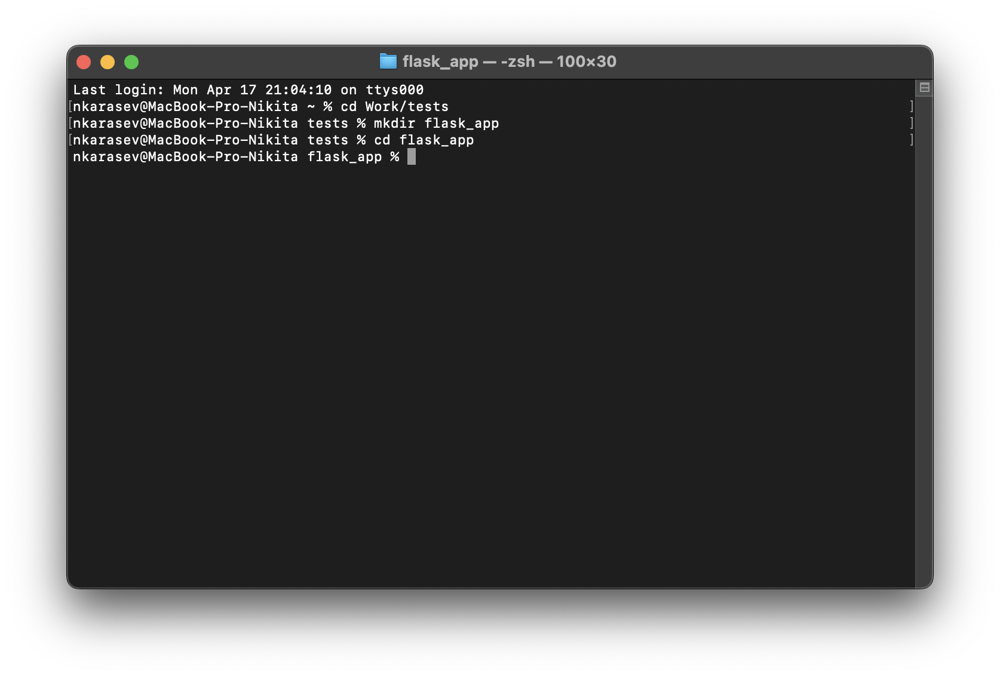
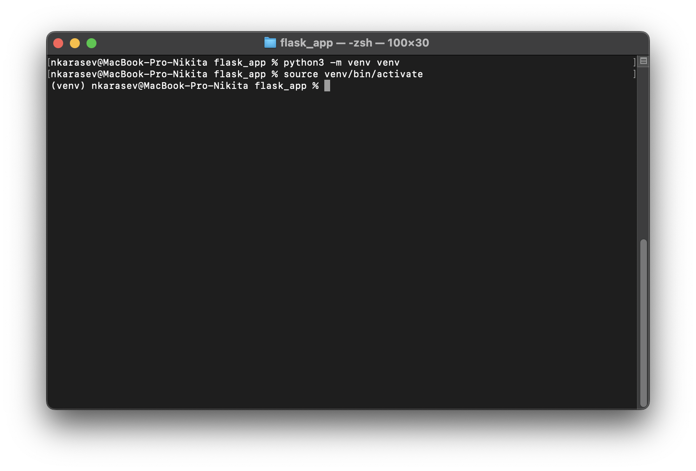
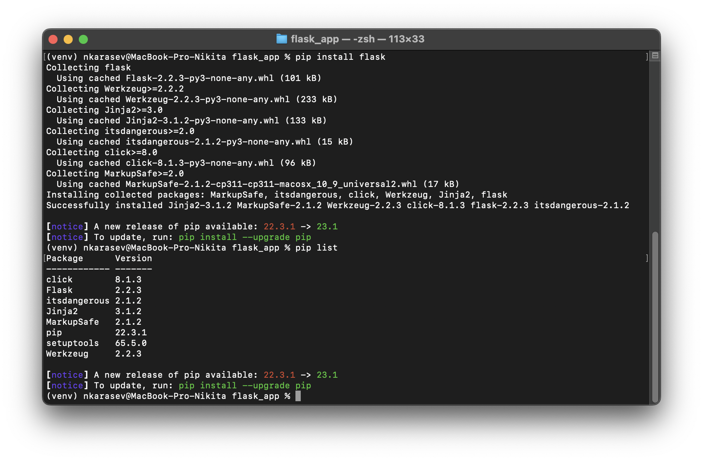

# Как установить Flask?


Flask — это микрофреймворк для создания простых проектов на языке программирования Python. Понятие «микрофреймворк» означает, что программист может сам установить нужные части инструмента в зависимости от задач.

Ниже будут показаны терминальные команды без разделителя $, так как он уже присутствует в строке ввода.

## Содержание:

1. [Создание рабочей папки](#создание-рабочей-папки)
2. [Создание виртуального окружения](#создание-вертуального-окружение)
3. [Сама установка](#сама-установка)
4. [Конец](#конец)

## Процесс установки

### Создание рабочей папки

Первое что нужно сделать – создать место где ваш сайт или приложение будут храниться. Рабочую папку можно создать через проводник/finder, но я продемонстрирую весь процесс через терминал:
```
# переходим в папку где удобнее хранить проект

cd тутпишемпутьдопапки

# создаём рабочую папку

mkdir flask_app

# переходим в созданную нами папку

cd flask_app

```



### Создание вертуального окружение

Если мы установим Flask в общую папку с библиотеками, то в дальнейшем можем столкнуться с кофликтом библиотек или их версий. Поэтому, создадим виртуальное окружение:

**Для Windows**
```
# создаём папку с компонентами окружения
py -m venv venv

# переходим в папку со скриптами
cd venv/Scripts

# запускаем виртуальное окружение
./activate
# ВНИМАНИЕ: на этом месте может возникнуть ошибка
# сразу посмотрите её решение в интернете и
# попробуйте активировать снова

# выходим из папки Scripts
cd ../..

```
**Для MacOS и Linux**
```
# создаём папку с компонентами окружения
python3 -m venv venv

# активируем окружение
source venv/bin/activate

```

Если всё получилось, то рядом со строкой терминала будет надпись **(venv)**.



### Сама установка

Осталось только установить сам Flask.

```
# устанавливаем Flask через пакетный менеджер pip

pip install flask

# проверяем Flask в общем списке библиотек

pip list

```



## Конец

Поздравляю, у вас всё получилось. А если не получилось, то проверьте все ли шаги были выполнены правильно.

[Вернуться к содержанию](#содержание)
